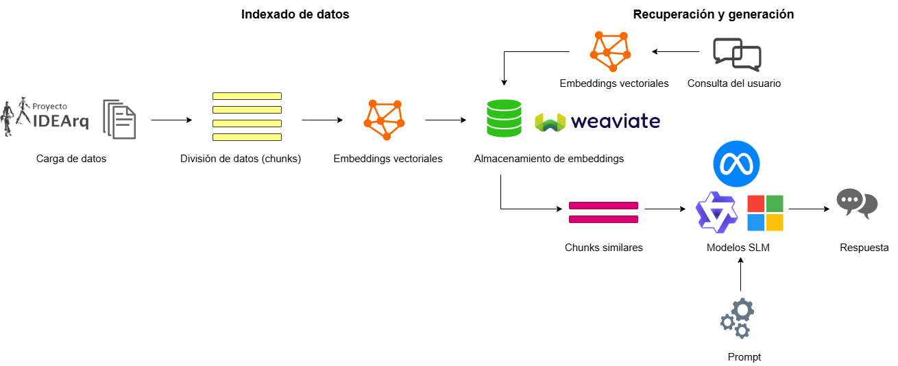

# RAG-IDEArq

Repositorio para experimentos y pipelines de un sistema Retrieval-Augmented Generation (RAG) sobre recursos de IDEArq (http://www.idearqueologia.org).

## Descripción

Este proyecto busca aplicar técnicas de RAG para enriquecer el análisis y la consulta de documentación arqueológica, facilitando la integración de modelos de lenguaje con una base de datos espcialziada.


## Estructura
```
RAG/
├── rag-idearq-langgraph-weaviate.ipynb    # Notebook del RAG y evaluación
├── rag-indexacion-weaviate.ipynb          # Notebook de indexación
├── rag-tfm-test.ipynb                     # Notebook de prueba
├── results/                               # Resultados de evaluaciones 
├── RAG-idearq/                            # Contenedor de docker de la base de datos Weaviate
|   ├──  weaviate_data                     # Base de datos vectorial              
|   └──  docker-compose.yml                # Fichero de instalación del contenedor
├── requirements.txt                       # Dependencias del proyecto
└── README.md                              # Documentación y guía
```

## Instalación

El proyecto se ha realizado con Python 3.12.11 en un entorno de conda y se ha utilizado Weaviate como base de datos vectorial en un contenedor de Docker.
Los modelos de lenguaje se han descargado en local con Ollama y los modelos de embedding provienen de HuggingFace.

```bash
git clone https://github.com/aguayoe/RAG.git
cd RAG
pip install -r requirements.txt
```

## Ejemplo completo de RAG paso a paso

El archivo [`rag-tfm-test.ipynb`](rag-tfm-test.ipynb) contiene un ejemplo completo y detallado de cómo implementar un pipeline de Retrieval-Augmented Generation (RAG) desde cero.  
En este notebook se muestra, paso a paso:

  - Cómo preparar y procesar los datos.
  - Cómo realizar la ingesta en la base de datos vectorial (Weaviate).
  - Cómo indexar los documentos.
  - Cómo consultar el sistema usando modelos de lenguaje.

Este ejemplo está pensado para usuarios que quieren aprender o replicar el flujo completo de un sistema RAG aplicado a Arqueología y Prehistoria.


## Licencia

CC0-1.0 license.

