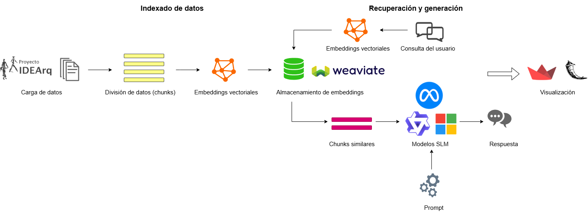

<div align="center">

# RAG-IDEArq
### Retrieval-Augmented Generation for IDEArq archaeological resources

A research/experimental repository for building **RAG pipelines** on top of **IDEArq** resources  
(http://www.idearqueologia.org) using **Weaviate**, **LangChain/LangGraph**, **Ollama** (local LLMs), and **HuggingFace** embeddings.

<p>
  
  
  
  
</p>

<p>
  <a href="https://github.com/aguayoe" target="_blank">
    
  </a>
</p>

</div>

---

## Overview
This project explores how to apply **Retrieval-Augmented Generation (RAG)** to improve the analysis and querying of **archaeological documentation**, integrating LLMs with a vector database and an app layer.



## Repository structure
```text
RAG/
├── rag-idearq-langgraph-weaviate.ipynb     # RAG notebook + evaluation
├── rag-indexacion-weaviate.ipynb           # Indexing notebook
├── results.pdf                             # Evaluation results
├── RAG-idearq/                             # Weaviate Docker setup
│   ├── weaviate_data/                      # Local vector DB storage
│   └── docker-compose.yml                  # Docker Compose for Weaviate
├── streamlit/                              # Streamlit application
│   ├── app_streamlit.py                    # Streamlit UI
│   └── backend_flask.py                    # Flask API backend
├── requirements.txt                        # Python dependencies
└── README.md                               # Documentation
```

## Requirements
- Python **3.12.x** (tested on **3.12.11**)
- Docker + Docker Compose
- (Recommended) Conda environment
- Ollama installed locally (for local LLM inference)

## Quickstart

### 1) Clone & install dependencies
```bash
git clone https://github.com/aguayoe/RAG.git
cd RAG
pip install -r requirements.txt
```

### 2) Start Weaviate (from `RAG-idearq/`)
```bash
cd RAG-idearq
docker compose up
```

### 3) Start the API + UI (two terminals)
Terminal 1 (Flask API):
```bash
python3 streamlit/backend_flask.py
```

Terminal 2 (Streamlit app):
```bash
streamlit run streamlit/app_streamlit.py
```

### 4) Run the local LLM (separate terminal)
Make sure Ollama is running first, then:
```bash
ollama run hf.co/MaziyarPanahi/Phi-3.5-mini-instruct-GGUF:Q6_K
```

## Notebooks
- `rag-indexacion-weaviate.ipynb`: ingest/index data into Weaviate
- `rag-idearq-langgraph-weaviate.ipynb`: run the RAG pipeline and evaluation

## Troubleshooting

### Recommended startup order
1. **Weaviate (Docker Compose)**
2. **Flask API backend**
3. **Streamlit UI**
4. **Ollama model** 

### Common ports 
- **Streamlit**: `http://localhost:8501`
- **Flask API**: often `http://localhost:5000` 
- **Weaviate**: commonly `http://localhost:8080` 

If you get a “port already in use” error, stop the process using that port or change the port in the corresponding config/script.

### Check that services are running
- Docker containers:
  ```bash
  docker ps
  ```
- Weaviate logs:
  ```bash
  docker compose logs -f
  ```
  (Run inside `RAG-idearq/`.)

### Docker Compose fails
- Make sure Docker is running and you have permissions.
- From `RAG-idearq/` try:
  ```bash
  docker compose down
  docker compose up --build
  ```

### Python dependencies issues
If `pip install -r requirements.txt` fails, create an isolated environment and retry:
```bash
python -m venv .venv
source .venv/bin/activate
pip install -r requirements.txt
```

### Ollama issues
- Confirm Ollama is installed and running.
- List local models:
  ```bash
  ollama list
  ```
- If the model name differs, replace it in the `ollama run ...` command.

## License
CC0-1.0 license.
